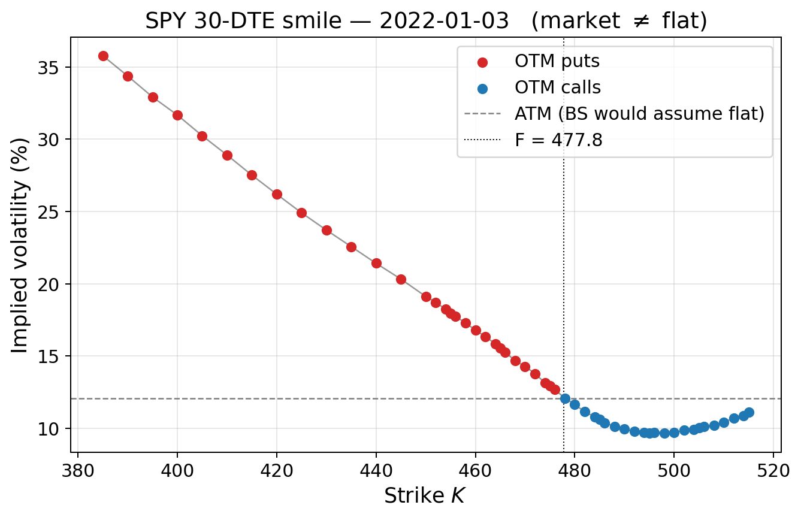

# SABR Model — Implementation and Empirical Evaluation



Computational replication of Hagan, Kumar, Lesniewski and Woodward (2002),
*Managing Smile Risk*, applied to a decade of SPY and QQQ end-of-day option
chains. Final project for ORIE 5610 (Stochastic Calculus), Cornell
University, Spring 2026.

## What this repository contains

* A from-scratch Python implementation of the Hagan asymptotic SABR
  implied-volatility expansion (formulas 2.17a–c and 2.18 in the paper),
  the Black 1976 forward-measure pricing layer, and an implied-vol
  inverter.
* An end-to-end empirical pipeline that consumes ~8.83 million SPY and
  QQQ option quotes (2014–2023) plus FRED Treasury yields, builds
  liquidity-filtered OTM smiles, and calibrates the SABR triple
  (α, ρ, ν) for β ∈ {0, 0.5, 1} on 210 cross-sections (630 total fits).
* A model-comparison study (SABR vs. flat Black-Scholes vs. frozen local
  volatility) on both static smile-fitting accuracy and one-week
  next-period prediction.

## Headline numbers

| Metric                                            | Value         |
|---------------------------------------------------|---------------|
| Calibrated market smiles                          | 210           |
| Total SABR fits                                   | 630           |
| Solver success rate                               | 100%          |
| Median fit RMSE                                   | 35 bps of vol |
| Median ratio (BS RMSE / SABR RMSE)                | ≈ 18×         |
| Empirical backbone exponent β (SPY / QQQ 30-DTE)  | 1.18 / 1.27   |
| Wall-clock for full grid (single laptop CPU core) | ~6 seconds    |

## Repository layout

```
.
├── src/                              Importable Python library
│   ├── black.py                      Black 1976 + IV inverter
│   ├── sabr.py                       Hagan (2.17) + ATM (2.18)
│   ├── local_vol.py                  Dupire local volatility
│   ├── sensitivity.py                ATM level / slope / curvature
│   ├── data_loader.py                FRED + optionsdx parsers, smile builder
│   ├── calibration.py                Trust-region least-squares SABR fitter
│   └── model_compare.py              BS / sticky / LV / SABR predictors
│
├── notebooks/                        Reproducible Jupyter notebooks
│   ├── 01_black_formula.ipynb        Black + IV inverter validation
│   ├── 02_sabr_vol.ipynb             SABR formula + sensitivity demos
│   ├── 03_local_vol.ipynb            Dupire local-vol numerical tests
│   ├── 04_parameter_sensitivity.ipynb  α, β, ρ, ν sweeps + joint heatmap
│   ├── 05_data_loading.ipynb         FRED + optionsdx loading and caching
│   ├── 06_calibration.ipynb          Single-smile and full-grid calibration
│   ├── 07_model_comparison.ipynb     SABR vs BS vs Local Vol study
│   ├── _build_module*.py             Notebook re-builders (deterministic)
│   ├── export_figs_round2.py         Figure-export script (round 2)
│   ├── export_figs_round3.py         Figure-export script (round 3)
│   └── extract_appendix_data.py      Per-pair dynamics / RMSE breakdown
│
├── requirements.txt                  Python dependencies
└── README.md
```

## Setup

```bash
# Python 3.10 recommended
python3 -m venv .venv
source .venv/bin/activate
pip install -r requirements.txt
```

## Reproducing the results

The cached intermediate data (`cache/*.parquet`, ~125 MB) is not tracked
in git. To regenerate it from raw inputs you need:

1. **FRED yield series** (`DGS1MO.csv`, `DGS3MO.csv`, `DGS6MO.csv`,
   `DGS1.csv`, `DGS2.csv`) — download from the FRED website and place
   under `Data/`.
2. **optionsdx end-of-day option chains** for SPY and QQQ, 2014–2023 —
   purchase or download from
   [optionsdx.com](https://www.optionsdx.com/), unzip into
   `Data/spy/` and `Data/qqq/` (one `*.txt` file per month).

Then:

```bash
# 1. Build the cache (takes ~2 minutes wall-clock)
jupyter nbconvert --to notebook --execute --inplace \
    notebooks/05_data_loading.ipynb

# 2. Run the full calibration grid (~6 seconds)
jupyter nbconvert --to notebook --execute --inplace \
    notebooks/06_calibration.ipynb

# 3. Generate model-comparison plots
jupyter nbconvert --to notebook --execute --inplace \
    notebooks/07_model_comparison.ipynb
```

Each notebook is self-contained and can also be opened interactively in
JupyterLab or VS Code.

## Quick-start: use the SABR library directly

```python
from src.sabr import sabr_vol
from src.black import black_call

# Hagan SABR implied volatility for an OTM call
sigma = sabr_vol(K=110.0, F=100.0, T=1.0,
                 alpha=0.20, beta=0.5, rho=-0.30, nu=0.40)
price = black_call(F=100.0, K=110.0, sigma=sigma, T=1.0, r=0.05)
print(f"σ_SABR = {sigma:.4f},  Black call price = {price:.4f}")
```

```python
from src.calibration import calibrate_sabr

# Calibrate (α, ρ, ν) at fixed β to a market smile
result = calibrate_sabr(
    strikes=K_market, sigma_market=iv_market,
    F=forward, T=time_to_expiry, beta=0.5,
)
print(result.alpha, result.rho, result.nu, result.rmse)
```

## Numerical validation

The implementation passes the following analytical tests at machine
precision (≈ 10⁻¹⁶) — see `src/black.py`, `src/sabr.py`, and notebook
`01_black_formula.ipynb` for the unit-style checks:

* Put-call parity: |C − P − D(F − K)| < 10⁻¹³
* Black implied-volatility round-trip: max error < 10⁻⁸
* SABR (2.17) at K = F equals SABR (2.18) ATM limit to < 10⁻¹⁵
* Synthetic SABR parameter recovery (no noise): per-parameter error
  < 10⁻¹³
* Dupire local volatility on a flat IV surface returns a constant σ
  with std < 2 × 10⁻¹⁷

## References

* Hagan, P. S., Kumar, D., Lesniewski, A. S., & Woodward, D. E. (2002).
  *Managing Smile Risk*. Wilmott Magazine, September 2002, 84–108.
* Black, F. (1976). *The Pricing of Commodity Contracts*. Journal of
  Financial Economics, 3(1–2), 167–179.
* Dupire, B. (1994). *Pricing with a Smile*. Risk, 7(1), 18–20.

## License

Code is released under the MIT License (see `LICENSE`). The optionsdx
EOD chain data is **not** redistributed here — please obtain it directly
from optionsdx.com if you wish to reproduce the empirical study.

## Author

Sihan Liang  ([sl3639@cornell.edu](mailto:sl3639@cornell.edu))
Cornell University, School of Operations Research and Information
Engineering.
